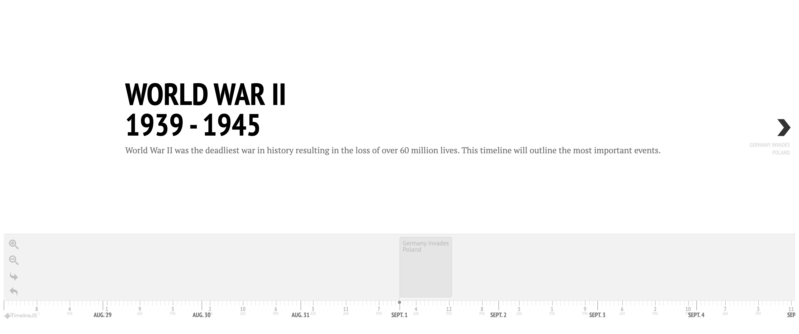

# 🌍 World War II Timeline

An interactive and educational timeline of key events during World War II, built using [TimelineJS3](https://github.com/NUKnightLab/TimelineJS3) by Knight Lab.

This project presents major global events from 1939 to 1945 in an accessible, scrollable timeline format. Perfect for history enthusiasts, educators, and anyone interested in learning more about the most significant conflict of the 20th century.



---

## 📦 Features

- 📅 Interactive timeline powered by TimelineJS3  
- 🌐 Fully client-side — no backend required  
- 🚀 Easy to launch locally using the `serve` npm package  
- 📖 Clean and readable event formatting via Google Sheets or JSON (configured in `index.html`)  

---

## 🛠️ Getting Started

To view the timeline locally, follow these steps:

### 1. Clone the Repository

```bash
git clone https://github.com/mawittenauer/ww2_timeline.git
cd ww2_timeline

npm install -g serve

serve .
```
